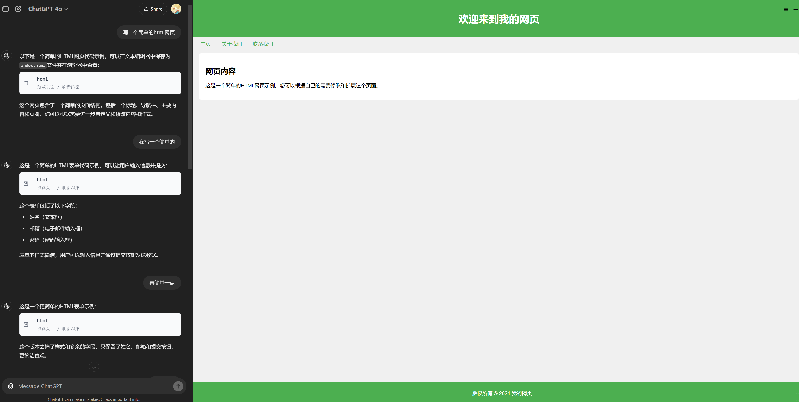

# chatgpt-render-html
chatgpt渲染预览html代码,像Claude一样实时预览html ( chatgpt renders preview HTML code blocks, previewing HTML in real-time like Claude )

## 使用方法

油猴安装: https://greasyfork.org/zh-CN/scripts/511723

# 预览

## 更新记录

### 2024-10-07 1.0.3版本
- 处理CSP限制增加nonce属性到script上, 注意: 要让gpt使用addEventListener添加事件
- 使用srcdoc属性提高性能和安全性
